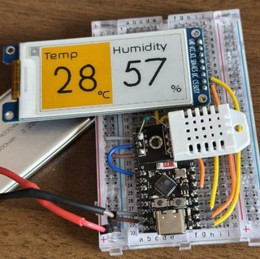

# comfort-board

A battery-friendly nursery / room comfort monitor built around an ESP32-C3,
a DHT22 temperature + humidity sensor, and a 2.13" 4-color e-paper panel
(JD79661 controller, 122 × 250 native).

The device wakes once an hour, takes one reading, repaints the display, and
falls back asleep. Between refreshes the whole board is in deep sleep.
During the ~5–10 s panel update the MCU sits in auto light sleep whenever
the driver is waiting on `BUSY`.



## Why "comfort"

The firmware doesn't just show numbers — it classifies the current reading
against baby-room comfort ranges and colors the whole panel accordingly:

| Level   | Temp (°C)      | Humidity (%RH) | Background | Digits |
| ------- | -------------- | -------------- | ---------- | ------ |
| OK      | 20 – 27        | 40 – 60        | white      | black  |
| Warn    | 18 – 19, 28 – 29 | 30 – 39, 61 – 65 | yellow    | black  |
| Danger  | < 18 or > 29   | < 30 or > 65   | red        | white  |

Ranges are tuned for a subtropical climate (e.g. Guangdong) where summer AC
is commonly set around 26 °C. Tweak the thresholds in
`main/gui/humidity_screen.cc` if your room isn't a nursery.

## Hardware

- **MCU**: ESP32-C3 (any module; dev kit or bare module with 4 MB flash)
- **Sensor**: DHT22 / AM2302 on a single GPIO (with 10 kΩ pull-up to 3V3)
- **Display**: 2.13" 122 × 250 4-color e-paper, JD79661 controller, 3-wire
  SPI (MOSI only) + DC / RES / BUSY

### Pin map (ESP32-C3)

| Signal      | GPIO     | Notes                                  |
| ----------- | -------- | -------------------------------------- |
| EPD BUSY    | GPIO3    | input, panel-driven                    |
| EPD RES     | GPIO4    | reset, active LOW                      |
| EPD DC      | GPIO5    | data / command                         |
| EPD CS      | GPIO6    | managed by SPI driver                  |
| EPD SCL     | GPIO7    | SPI clock                              |
| EPD SDA     | GPIO10   | SPI MOSI                               |
| DHT22 DATA  | GPIO0    | needs external 10 kΩ pull-up to 3V3    |

Strapping pins (2 / 8 / 9), USB-JTAG (18 / 19) and UART0 (20 / 21) are kept
free on purpose. GPIO0 is also a strapping pin but behaves fine for a
1-wire sensor once boot is past.

All pin definitions live in `main/common/config.h`.

## Build & flash

Requires ESP-IDF ≥ 5.5.3.

```bash
idf.py set-target esp32c3
idf.py build
idf.py -p /dev/ttyACM0 flash monitor
```

First build will pull in the managed components declared in
`main/idf_component.yml`:

- `esp-idf-lib/dht` — DHT22 driver
- `lvgl/lvgl` ^9.2 — UI framework

## Project layout

```
main/
├── common/
│   └── config.h             GPIO & timing constants
├── hardware/display/
│   ├── epaper_bus.{h,cc}    SPI + GPIO, sleep-safe teardown
│   ├── epaper_driver.{h,cc} abstract e-paper interface + singleton
│   └── jd79661_driver.{h,cc} JD79661-specific command sequences
├── gui/
│   ├── lvgl_display.{h,cc}  LVGL display bind: RGB565 framebuffer,
│   │                        4-color quantization, 90° rotation to panel
│   ├── humidity_screen.{h,cc} two-panel landscape layout + level coloring
│   └── fonts/               generated LVGL fonts (see scripts/gen_fonts.sh)
├── main.cc                  app_main: read sensor → render → deep sleep
└── CMakeLists.txt

assets/                      TTF sources for font generation
scripts/gen_fonts.sh         lv_font_conv wrapper
sdkconfig.defaults           PM / tickless / LVGL Kconfig defaults
```

## How a wake cycle looks

1. `esp_sleep_get_wakeup_cause()` logs the reason (timer / cold boot).
2. `esp_pm_configure()` turns on auto light sleep (DFS 10–160 MHz).
3. `EPaperDriver::GetInstance()->Reset()` powers up SPI, resets the panel,
   runs the JD79661 init sequence.
4. LVGL is initialised with a full-screen 250 × 122 RGB565 buffer.
5. `CreateHumidityScreen()` builds the two-panel layout once.
6. DHT22 is polled with up to 3 retries. Values are truncated toward zero
   (DHT22's ±0.5 °C / ±2–5 %RH accuracy makes the fractional digit noise).
7. `UpdateHumidityScreen()` writes the digits and applies the comfort-level
   background color.
8. `lv_refr_now()` blocks while the flush callback quantizes RGB565 → the
   2 bpp 4-color palette, rotates 90° CCW, and drives the panel over SPI.
   The long `BUSY` waits inside that call happily cooperate with
   tickless-idle light sleep.
9. `Sleep()` parks the panel (`cmd 0x07 / 0xA5`), `DisablePower()` tears
   down SPI, `esp_deep_sleep_start()` sleeps the MCU for 1 hour.

## Power profile (target)

| Phase                           | Duration    | Typical current |
| ------------------------------- | ----------- | --------------- |
| Boot + init                     | ~200 ms     | active, 30–50 mA peaks |
| DHT22 read (1–3 attempts)       | ~50 ms – 4 s | active + brief light sleep |
| Panel refresh (4-color)         | ~5–10 s     | light sleep dominated by BUSY |
| Deep sleep (1 h interval)       | ~1 h        | µA-range (ESP32-C3 deep sleep + DHT22 idle) |

> Tuning notes live in `main/hardware/display/epaper_bus.cc::DisablePower()`:
> the deep-sleep current is sensitive to how the panel-facing GPIOs are left
> on the way into `esp_deep_sleep_start()`. TL;DR: don't touch them — let
> the SoC auto-tristate the pads.

## Fonts

Both fonts are Apple Garamond Bold, generated by
[`lv_font_conv`](https://github.com/lvgl/lv_font_conv):

- `font_digits.c` — 72 px, glyphs `0123456789.-°%`
- `font_label.c` — 21 px, ASCII + `°`

To regenerate (after dropping a new TTF under `assets/` and editing sizes in
the script):

```bash
./scripts/gen_fonts.sh
```

## Customising

- **Update interval** — `DEEP_SLEEP_INTERVAL_US` in `main/common/config.h`
- **Comfort thresholds** — `TempLevel` / `HumiLevel` in
  `main/gui/humidity_screen.cc`
- **Layout / strings** — `CreateHumidityScreen()` in the same file
- **GPIO pin-out** — `main/common/config.h`
